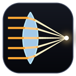

# LuxTrace

### Optical Design Studio

A desktop application for **optical and illumination design**, using
**OpenCASCADE Technology (OCCT)** as the geometric kernel and **Qt 6** for the UI.
It builds optical geometry as B-Rep solids, runs a Monte Carlo ray trace, and
reports what a real design review asks for: an irradiance map, a far-field
intensity distribution, spot metrics, a full energy budget, and an error bar on
the answer.

Language/stack: **C++20**, **Qt 6.8.2 (MSVC 2022)**, **OCCT 7.8.1 (vcpkg)**.

[](https://github.com/kutaygunal/LuxTrace/actions/workflows/ci.yml)

*The name is `lux`, the SI unit of illuminance the app computes, and `trace`,
for the ray tracing that gets there.*

---

## Capabilities

Benchmarked against what a commercial illumination-design package (LightTools,
TracePro, OpticStudio) is expected to do:

| Capability | LuxTrace |
|---|---|
| Geometry | 26 parametric OCCT scenes, plus STEP/IGES import of a customer's own CAD; instanced parts share one mesh and one hierarchy |
| Surface normals | Read off the exact B-Rep at each tessellation node and interpolated across the facet, so the mesh is no longer what limits how sharply a scene focuses |
| Materials | A catalogue by name — N-BK7, N-SF11, fused silica, PMMA, polycarbonate, water, cement, Al/Ag/Au — with Sellmeier dispersion, Abbe numbers and complex-index Fresnel for the metals |
| Glass catalogue | Import a real catalogue — a Zemax `.agf` from Schott, Ohara, CDGM, Hoya or Sumita, or a refractiveindex.info `.yml` entry — and the ten built-in names become a catalogue a lens designer can actually type into |
| Media | A medium stack with priorities: cemented doublets, immersed optics, clad guides and nested solids all refract against the right pair of indices |
| Coatings | Ideal AR/HR by residual, measured R(lambda) tables, and a characteristic-matrix thin-film solver |
| Scattering | GGX microfacet with Smith masking, ABg / Harvey-Shack, measured BSDF tables, Lambertian, and Henyey-Greenstein volume scattering inside a medium |
| Polarisation | Stokes vectors and Mueller matrices behind a switch: Brewster's angle, polarisers, retarders and the phase of total internal reflection |
| Light sources | Point / Lambertian / collimated over a real emitting area, with absolute flux in watts or lumens and a real spectrum (monochromatic, RGB, blackbody, white LED, D65 or a measured SPD) |
| Measured ray sources | A vendor's measured ray set — Zemax binary `.dat`, ASAP `.dis`, or TracePro text — loads as an emitter, so "model an LED" becomes "use this LED" |
| Multi-source | Any number of sources, each placed relative to the scene emitter, with per-source arrival tagging and the ray budget shared in proportion to power |
| Units | W/m² or lux on the receiver, W/sr or candela in the far field, from a source flux the user sets |
| Estimator | Owen-scrambled Sobol emission, aiming at the scene, next-event estimation at diffuse bounces, Russian roulette and branch collapsing — 1.5x to 28x tighter error bars for the same rays |
| SIMD | A four-wide AVX2 leaf intersection, probed at run time and bit-for-bit identical to the scalar kernel |
| Detectors | Any number, each with its own frame, resolution and acceptance cone; tilted and off-axis receivers bin against themselves |
| Measurements | Spot metrics, far-field intensity, MTF, wavefront error and Strehl, CIE chromaticity and colour temperature |
| Studies | Convergence, through-focus, parameter sweeps in 1D and 2D, Nelder-Mead and CMA-ES optimisation, and Monte Carlo tolerance analysis with a yield and a sensitivity ranking |
| Progressive results | The image forms and the error bar shrinks while the trace runs |
| Import/export | JSON config; CSV irradiance, intensity, metrics and ensembles; **IES LM-63 and EULUMDAT** for DIALux, AGi32 and Relux; PNG of any view; a one-click HTML report |
| Validation | `--validate` checks the tracer against seven closed forms derived outside it and prints the residuals |

---

## The physics

Every optical property lives in one struct (`SurfaceOptics`) shared by the B-Rep,
mesh and BVH representations of a surface, so adding one reaches the tracer
without touching either conversion loop.

**Surface normals.** Read off the exact B-Rep surface at each tessellation node
and interpolated across the facet by the barycentric coordinates the intersection
already produces. A facet normal sits up to half the angular deflection from the
true one and a mirror doubles that into the reflected ray; removing that term
took the elliptical reflector's spot from 10.8 mm RMS to 0.99 mm and moved its
best focus from 22 mm off the analytic answer to 1.5 mm.

**Fresnel reflectance.** Unpolarised `R = (Rs + Rp) / 2` from the angle of
incidence: about 4 % for air against n = 1.5 at normal incidence, rising
continuously to 1 at grazing, and exactly 1 past the critical angle. This is what
makes a lens efficiency mean something — the old fixed 4 %/96 % split charged the
same loss to a ray arriving at 80 degrees as to one arriving straight on.

**Beer-Lambert bulk absorption.** `exp(-alpha * t)` over the distance actually
travelled inside a medium, with the medium's identity tracked along the path so
the right glass is charged. This is the loss that scales with path length rather
than with hit count, and it is the reason a 200 mm light guide is measurably
dimmer than a 100 mm one. Reported separately from surface absorption.

**Coatings.** Every real lens is coated, and a bare one overstates its loss by
roughly 3.5 % per surface. Three tiers: an ideal residual with the angular
roll-off a real stack has, a measured `R(lambda)` table, and a
characteristic-matrix solver over a handful of layers. A coating can never defeat
total internal reflection, so a light guide is safe from one — and is shipped
uncoated anyway, because that is how a light pipe is made.

**Scattering.** A real BSDF rather than a tilt of the normal: GGX microfacet with
Smith shadowing-masking, the ABg model TracePro and LightTools expose, a measured
BSDF table, and Lambertian kept as its own case. Each is energy conserving, each
is sampled with the weight that makes it so, and each reports a total integrated
scatter — the number a scatter specification is actually written in. The old
Gaussian slope error stays for the scenes built against it.

**Volume scattering.** A scattering coefficient and a Henyey-Greenstein phase
function *inside* a medium. Every white diffusing plastic in every luminaire is a
volume scatterer, and a surface model has no way to say so.

**Media.** A branch carries a stack of the media it is inside, with a priority to
resolve overlap. A cemented doublet refracts glass against glass, an immersed
lens against its fluid, a clad guide against its cladding.

**Dispersion.** Sellmeier from a glass catalogue, quoted by name — N-BK7, N-SF11,
fused silica, PMMA, polycarbonate — with Abbe numbers and internal transmittance
along for the ride. Metals carry a complex index, so an aluminium mirror at 45
degrees is genuinely not the same as at normal incidence, and not the same at
460 nm as at 620.

**Spectrum.** One wavelength sampled per ray from a real distribution —
monochromatic, three RGB lines, a blackbody, a phosphor-converted white LED,
CIE D65, or a measured SPD — so a spectral trace costs what a monochromatic one
costs and resolves to whatever the ray budget supports. Lumens are watts through
the CIE V(lambda) curve, which is what makes lux and candela available at all.

**Polarisation.** A Stokes vector per branch and a Mueller matrix per
interaction, behind a switch. It costs four times the per-ray state and most
illumination work does not need it — but it is what makes Brewster's angle a
polarising effect rather than a dip in a curve, and what gives total internal
reflection the phase a Fresnel rhomb depends on.

Roughness, scatter and absorption also have **scene-wide overrides**, so a
polished mirror can be turned matte and re-run without rebuilding any geometry —
they are ray-time properties, and re-tessellating an optic to change its polish
would be absurd.

## The scene library

26 scenes, all built from OCCT B-Rep and enumerated from one registry
(`GeometryProvider::Scene`), so the UI, the diagnostics and the tests pick them
up automatically. Each declares 2-4 editable dimensions (`paramInfo`), the last
of which is always the receiver position; the emitter follows the geometry, so
lengthening a paraboloid moves the source to its new focus.

Efficiencies are for a Lambertian source at 50 000 rays, with the full physics on.

**Reflective**

| Scene | Eff. | What it shows |
|---|---|---|
| Parabolic Reflector | 83.8 % | Source at the focus is collimated: 1.3 degree beam FWHM |
| Elliptical Reflector | 59.9 % | One focus imaged onto the other |
| Spherical Reflector | 91.7 % | Spherical aberration, against the parabola's clean spot |
| Off-Axis Parabola | 20.6 % | Off-axis segment with the receiver offset to match |
| Parabolic Trough | 49.2 % | Collimates in x only: a line, not a spot |
| Compound Parabolic Concentrator | 22.7 % | Nonimaging: inside the acceptance angle in, the rest rejected |
| Conical Concentrator | 14.4 % | The naive funnel, measurably worse than the CPC |
| Cassegrain (two-mirror) | 9.9 % | Folded path; the secondary shadows the axis |
| Corner-Cube Retroreflector | 22.3 % | Three orthogonal mirrors send light back the way it came |

**Refractive**

| Scene | Eff. | What it shows |
|---|---|---|
| Ball Lens | 12.9 % | Strong focusing, heavy aberration |
| Plano-Convex Lens | 12.3 % | Source at the front focus, so the lens collimates |
| Biconvex Lens | 12.8 % | Roughly twice the power at the same radius |
| Plano-Concave Lens | 15.7 % | Negative power: the beam spreads |
| Half-Ball Lens (LED dome) | 68.3 % | Near-normal incidence lets light escape instead of being trapped |
| Cylindrical Rod Lens | 11.7 % | Power in x only: a point images to a line |
| Fresnel Lens (stepped) | 24.5 % | Annular facets, most of the deflection without the glass |
| Axicon (ring former) | 78.7 % | Collimator + cone: a ring with a dark centre |
| Microlens Array (5 x 5) | 11.6 % | Grid of lenslets; light between them passes straight through |
| Glass Prism | 50.9 % | Deviates in one plane; in RGB it separates the bands |

**Total internal reflection**

| Scene | Eff. | What it shows |
|---|---|---|
| Light Guide (round) | 74.3 % | Rays past the critical angle bounce to the far end |
| Square Light Guide | 77.0 % | Flat walls mix the beam differently |
| Tapered Light Guide | 59.9 % | A taper steepens rays until some break TIR and leak |
| Porro Prism (TIR retro) | 15.6 % | Two 45-degree faces fold the beam straight back |

**Scattering**

| Scene | Eff. | What it shows |
|---|---|---|
| Integrating Sphere | 26.7 % | Matte white cavity: every bounce is Lambertian, the port sees a uniform field |
| Diffuser Plate | 32.4 % | Transmissive diffuser washing a bright spot into an even glow |

**Multi-source**

| Scene | Eff. | What it shows |
|---|---|---|
| LED Array Luminaire | 74.2 % | A row of reflector cups, one LED to a cup. The scene places a single emitter at the focus of the leftmost cup, so a run out of the box lights one cup and leaves the rest dark — which is the point. Add a source per remaining cup, each offset along x by a whole multiple of the pitch, and the receiver fills in one beam at a time. Every other scene in this library is built around a single emitter on an axis; this one cannot be described by one at all |

The round light guide used to read 89 %. It now reads 74 % because its entrance
and exit faces pay a Fresnel reflection and its glass absorbs 4.4 % of the light
over the zig-zag path — both of which a real rod does and the old model did not.

With an isotropic **Point** source most scenes drop to roughly half: the backward
hemisphere is simply lost. That is the physically correct answer, and the app
does not quietly substitute a Lambertian emitter to hide it. A few scenes behave
differently for good reasons — the elliptical reflector does *better* with a
point source, because its Lambertian hemisphere aims straight at the hole in the
bottom of the cup.

The whole 26-scene library at 50 000 rays each traces in **0.51 s**. Energy is
accounted for exactly in every scene: `detected + absorbed + escaped + truncated
== emitted` to 1e-9.

### Determinism
A run is bit-identical no matter how many threads execute it. Every ray seeds
its own RNG from its index — for its emission direction, its emitting-area
sample and its scatter/roughness draws alike — and the scalar totals reduce in
chunk order rather than thread order. `--bench` checks this on every
scene/source combination.

## Interoperation: measured data in

Two readers turn the engine's built-in data into a tool that accepts the
industry's. Both load once and share the result, because a ray file is tens of
megabytes and a study traces the same one hundreds of times.

**Measured ray sources.** LED vendors publish their parts as ray sets — a few
hundred thousand rays, each with a position on the emitting surface, a
direction, a flux and often a wavelength, measured on a goniophotometer. Reading
one turns "model an LED" into "use this LED", and it is the single most-requested
interoperation in illumination design. Three formats cover what people actually
have: the Zemax binary source file (`.dat`, a 208-byte header followed by seven
or eight float32 per ray — the layout TracePro and most vendor downloads use for
interchange), ASAP `.dis`, and the plain text ray files TracePro and several
vendors ship. The reader dispatches on content rather than extension, because
vendors ship binary sets as `.dat`, `.ray`, `.txt` and `.dis` indiscriminately.
A capped load takes an evenly-strided subset rather than the leading block, so
the first N rays of a scanned measurement — one edge of the die — do not stand in
for the whole. A ray file is an `EmittedRay` stream, so it needs no engine
change: emission is the only place that branches, and everything downstream
already carries a per-ray weight, wavelength and origin.

**Glass catalogue import.** The engine shipped with ten materials hard-coded.
That is a demonstration, not a tool: the first thing a lens designer does is
type a glass name, and if it is not there the tool is not usable for their job
whatever else it does. Two formats cover almost everything anyone actually has:
the Zemax `.agf` catalogue format that Schott, Ohara, CDGM, Hoya and Sumita all
publish in, and a refractiveindex.info `.yml` entry. Everything resolves into
the same fixed-size `OpticalMaterial` the tracer already reads, at load, so
nothing on the hot path changes. A glass whose dispersion formula cannot be
represented as a Sellmeier is resampled onto the table model rather than
dropped.

**Multi-source.** A luminaire with more than one LED — and any system needing a
stray-light source alongside the signal source — is a configuration with more
than one emitter. `SimConfig` holds a primary source plus any number of
`SourceSpec`s, each placed *relative* to the scene emitter by default, which is
what makes a four-LED array four copies of one spec at four offsets rather than
four hand-placed sources. The ray budget is shared between sources in proportion
to power — the variance-optimal split: a source contributing a tenth of the
light gets a tenth of the rays and every source ends up with a comparable error
bar. Each arrival is tagged with the source that emitted it, so the receiver can
say which beam is which. A run with an empty extra-source list is bit-identical
to what it was before there was a list at all.

## Measurements, not impressions

- **Spot metrics** are computed as densities (flux per mm^2), so they do not move
  when the receiver is re-binned: peak, mean over the lit bins, min/peak and
  mean/peak uniformity, flux centroid, RMS radius, D50/D86 encircled-energy radii
  and the FWHM of the profile through the centroid.
- **Far-field intensity** bins the direction every ray leaves the system on into
  theta/phi cells and divides by each cell's solid angle. Without that division an
  isotropic source reads as dark at the poles simply because those cells are
  small. The total over the sphere equals `escaped + detector` exactly. That grid
  is already the candela distribution a luminaire is specified by, so it exports
  as **IES LM-63** and **EULUMDAT** and goes straight into DIALux, AGi32 or Relux.
- **Absolute units.** The source carries a flux in watts or lumens, so the
  receiver reads in W/m² or lux and the far field in W/sr or candela. A
  dimensionless fraction of an unnamed unit is not a number that can go in a
  specification, and lux needs a real spectrum underneath it: lumens are watts
  weighted by the CIE V(lambda) curve, so every ray is emitted carrying how much
  of it the eye sees.
- **Monte Carlo error bars.** Each run reports one standard error on its
  efficiency — measured across sixteen independent scrambles of the sampling
  sequence, because a low-discrepancy sequence is not a set of independent
  samples and its ray-to-ray spread would report the error a *random* run of the
  same size would have had. The convergence sweep traces the same scene at
  geometrically spaced ray counts and says whether the last two points agree
  within 2 sigma — the practical form of "have I traced enough rays?".
- **Image quality.** MTF from the line spread function the arrivals already
  describe, with the diffraction limit of a given aperture drawn beside it; and,
  from the optical path each arrival carries, an OPD map, an RMS wavefront error
  and a Strehl figure — flagged as not meaningful past the quarter wave where
  Marechal's approximation stops holding, rather than reported as an underflowed
  zero.
- **Yield, not just performance.** A tolerance study perturbs every dimension by
  its limit, traces the ensemble and reports what fraction of production passes —
  and ranks the dimensions by how much of the spread each one causes, so the
  answer is which one to tighten rather than only that the design is fragile. The
  same seed reproduces the same production run, which tolerancing tools rarely
  manage.
- **Through focus** is a post-process, not a re-trace. Every receiver arrival is
  recorded with the direction it came in on, so the arrivals can be propagated
  analytically to any nearby plane and the spot size read off. One trace answers
  every plane; the minimum is refined by a parabolic fit rather than quantised to
  the sweep step.
- **A report, not a folder.** One HTML document with the scene, its parameters,
  the quantities they imply, the energy budget, every plot, the metrics, any
  studies that were run, and the seed stamped on it — so the numbers in it can be
  regenerated exactly rather than merely read.

## Performance

The tracer was originally a single-threaded brute-force scan of every triangle
for every ray segment, running on the GUI thread. Same workload:

| Workload | Before | After |
|---|---|---|
| 3 scenes x 30 000 rays | 48.1 s | **0.17 s** |
| 3 scenes x 1 000 000 rays | ~27 min | **1.35 s** |

What changed: a SAH **BVH** over the flattened triangles, **multithreading** over
rays with dynamic 512-ray chunks, a **cached** geometry/mesh/BVH per (scene,
parameters) pair, and **bounded** ray-path recording for the diagram.

Since then the work has moved from the intersection kernel to the estimator,
which is where it was always going to pay. **Owen-scrambled Sobol** emission with
replicated scrambling, **emission aiming** at the scene, **next-event estimation**
at diffuse bounces, **Russian roulette** in place of the old hard cutoff and
**branch collapsing** at interfaces together buy this, at the same ray count:

| Scene | Error bar before | after | tighter by |
|---|---|---|---|
| Elliptical Reflector | ±0.312 % | ±0.011 % | **28x** |
| Parabolic Reflector | ±0.208 % | ±0.013 % | **16x** |
| Conical Concentrator | ±0.227 % | ±0.025 % | **9x** |
| Biconvex Lens | ±0.227 % | ±0.049 % | **4.6x** |
| Integrating Sphere | ±0.221 % | ±0.087 % | **2.5x** |

An error bar 16x tighter is 256x fewer rays for the same answer. The figures are
honest rather than optimistic: a low-discrepancy sequence is deliberately *not* a
set of independent samples, so the ray-to-ray spread no longer measures the error
of the mean — the budget is split into sixteen independent scrambles and the
spread *across* them is what gets reported. A test checks that number against the
actual spread over twelve independent seeds.

Tessellation used to be the other lever on accuracy, and mostly is not any more.
The normals are now read off the exact B-Rep surface and interpolated across the
facet, so what a coarse mesh costs is hit *position* rather than surface
*direction* — a far weaker constraint. The elliptical reflector's spot went from
10.8 mm RMS to 0.99 mm on the same mesh, and its best focus from 22 mm off the
analytic answer to 1.5 mm. Repeated bodies are **instanced**: the microlens array
is one lenslet, one hierarchy and twenty-five transforms, so it now carries the
same fine mesh as every other optic instead of a hand-coarsened one, at a third
of the triangles it used to store.

A four-wide BVH and float bounding boxes were both built and benchmarked against
the current binary/double hierarchy. Neither paid on this workload, and both were
removed — the measurements are in the comment on `TraceScene::BvhNode`.

**A four-wide leaf.** The hierarchy's leaves hold four triangles and used to test
them one at a time in scalar double. The data layout is already exactly what a
4-wide AVX2 double intersection wants, so the wide path is the option the layout
favours. It is probed at run time — `simd::avx2Available()` answers once and
caches, and the probe lives deliberately outside the AVX2-compiled translation
unit — and it is bit-for-bit identical to the scalar loop: the arithmetic is
written in the same order and associations as Moller-Trumbore, with explicit mul
and add intrinsics so no fused multiply-add can quietly re-round an
intermediate, and the caller picks the winner by walking the four lanes in index
order, which is what makes an exact tie resolve the way the scalar loop resolved
it. The scalar path stays: it is what the brute-force reference walk uses, so
the equivalence test still means something, and it is what runs on a machine
without AVX2. Two tests pin the wide path — the wide leaf agrees with the scalar
one bit for bit, and a scene traces identically with and without it.

## Build

Prerequisites:
- CMake >= 3.22
- Qt 6, MSVC kit
- OpenCASCADE via vcpkg: `vcpkg install opencascade --triplet x64-windows`

Say where those two live, once. No path to either is written into any file in
this repository, and a new terminal picks these up:

```bash
setx VCPKG_ROOT C:/src/vcpkg
```

```bash
setx QT_ROOT_DIR C:/Qt/6.8.2/msvc2022_64
```

Then configure and build through the presets:

```bash
cmake --preset windows-msvc
```

```bash
cmake --build --preset release
```

Nothing has to be copied next to the executable. The vcpkg toolchain brings OCCT
and everything under it into the build tree on every build, and `ctest` puts the
Qt kit on `PATH` for the duration of a test, so a fresh clone runs the whole
suite with no deployment step at all.

To pin the two locations without environment variables, write a
`CMakeUserPresets.json` inheriting from `windows-msvc`; it is git-ignored, so
personal paths stay out of the repository. Passing `-DCMAKE_TOOLCHAIN_FILE` and
`-DCMAKE_PREFIX_PATH` directly still works, and still wins over both.

### CI
Every push to `main` and every pull request builds this same kit on GitHub
Actions (`.github/workflows/ci.yml`) and runs the three checks as three separate
steps -- `ctest`, the `--validate` closed forms and the `--bench` determinism
assertion -- so a unit regression, a physics regression and a determinism
regression each report as their own failure. The vcpkg commit is pinned, so the
OCCT under test is the one the developer box has.

## Test

```bash
ctest --preset release
```

290 tests in 58 suites, no external framework. The scene and test counts are
derived, not retyped: `python tools/regenerate_counts.py` regenerates them from
`--smoke` and the test binary's own totals. Beyond the original coverage
(Moller-Trumbore branches, BVH vs brute force, energy conservation, TIR critical
angle, edge cases, sampling statistics, detector binning, the async worker, and
the irradiance patterns each scene claims to produce), the physics and analysis
are pinned against arithmetic rather than against another simulation:

- **validation** — the same seven closed forms `--validate` prints, run in CI.
  This is the suite that says the physics is right rather than merely
  self-consistent.
- **media** — exact surface normals against the analytic ones, outward winding on
  every facet of a closed solid, a nested solid refracting against its host
  rather than against air, priority resolving overlap, and optical path length.
- **estimator** — that Sobol sampling beats random at the same ray count, that
  aiming and next-event estimation do not move the answer, and — the one that
  matters — that the reported error bar matches the spread measured over twelve
  independent seeds. An error bar makes exactly one claim, and this is it.
- **material / coating** — published n_d and Abbe numbers reproduced from the
  Sellmeier coefficients, monotonic dispersion, complex-index metal reflectance
  against its closed form at normal incidence and its pseudo-Brewster dip at
  grazing, a quarter-wave stack solved against its own analytic result, and that
  no coating can defeat total internal reflection.
- **bsdf** — a Lambertian lobe against `sin^2(theta)`, a microfacet lobe
  conserving energy at three roughnesses and three angles, an ABg lobe with the
  power-law slope it claims, and the Henyey-Greenstein phase function
  integrating to one.
- **polarised** — Brewster's angle reflecting no p, crossed polarisers passing
  nothing, Malus's law at 45 degrees, a quarter-wave plate making circular light,
  the phase of total internal reflection, and that no interaction ever produces a
  Stokes vector that light could not be in.
- **units** — that a photometric run delivers the lumens it was asked for, and
  that the two units agree only where the optics are colourless.
- **instances** — a hierarchy over placements agreeing with brute force, and an
  instanced array tracing the same optic as a copied one.
- **cad** — a STEP file round-tripping into traceable geometry, an assembly
  splitting into parts, unit conversion, a bad file reported rather than thrown,
  and — the one that matters most — that an imported file is what gets traced
  rather than whichever scene happens to be selected, with its receiver and its
  source placed around the part on whichever axis it is lit from.
- **sweep / optimise / tolerancing** — that a sweep finds the ellipse's focus,
  that both searches improve on their starting design, and that the same seed
  reproduces the same simulated production run.
- **imagequality** — that a tighter spot carries contrast to higher frequencies,
  that nothing beats the diffraction limit, and that Strehl is flagged as
  meaningless past the quarter wave where Marechal's approximation stops holding.

- **fresnel** — checked against Rs and Rp recomputed in the test over the whole
  angular range and three indices; the 4 % closed form at normal incidence;
  monotonic rise to 1 at grazing; continuity into total internal reflection.
- **absorption** — `exp(-alpha L)` for three coefficients and three lengths; that
  the vacuum leg before the glass is not charged for; the on/off and scale gates.
- **scatter / roughness** — cosine-weighted re-emission (E[cos] = 2/3, which
  distinguishes it from a uniform hemisphere), slope error RMS, and that a
  diffusing mirror collapses an ellipsoid's focus.
- **spectral** — dispersion exact at the reference line, blue bending more than
  red, the three colour bands summing to the whole pattern, and a prism
  separating them.
- **intensity** — an isotropic source reading flat per steradian, and the far
  field accounting for exactly `escaped + detector`.
- **metrics / focus** — a synthetic uniform disc whose RMS radius is `R/sqrt(2)`
  and whose encircled-energy radius is `R sqrt(f)`; a synthetic converging cone
  whose waist the sweep has to find to within a millimetre.
- **convergence** — error bars shrinking at least as fast as `1/sqrt(N)` across a
  64x range. At least, because a low-discrepancy sequence converges faster than
  that and the sweep is expected to beat it; converging more slowly would be the
  bug.
- **params / config** — every scene's parameter block, clamping and NaN
  rejection, geometry staying alive while a run holds it, and a JSON round trip
  that identifies scenes by name rather than by registry index.

## Install and package

An install writes a self-contained directory: the executable, the Qt and OCCT
runtimes, the OCCT dependency chain underneath them, and the plugin tree, all
flat so `LuxTrace.exe --validate` works in the folder it lands in.

```bash
cmake --install build --config Release --prefix dist
```

```bash
cpack --config build/CPackConfig.cmake -C Release
```

The second writes `LuxTrace-1.0.0-win64.zip`, which is the whole application:
unpacking it is installing it, since nothing is read from outside the directory
and nothing is written to the registry. The tree carries the offscreen platform
plugin as well as the desktop one, because every headless diagnostic runs under
`QT_QPA_PLATFORM=offscreen` and `windeployqt` on its own ships only the plugin
the window needs.

## Run

Run `LuxTrace.exe`, pick a scene, adjust its dimensions, choose a source
and press **Run**. The trace runs on a worker thread: the inputs freeze for the
duration, a progress bar tracks it, and **Cancel** stops it within milliseconds
while keeping the rays that already finished.

The image forms while the trace runs — a snapshot arrives every couple of hundred
milliseconds, so the heatmap fills in and the error bar visibly shrinks, and a run
can be stopped as soon as the answer is good enough.

Seven tabs over a metrics panel, with a live strip of derived quantities under
the parameters (f-number, numerical aperture, acceptance angle, concentration,
etendue, where the paraxial focus lands) that updates as the spin boxes move,
before anything is traced:

| Tab | Shows |
|---|---|
| **3D View** | The OCCT viewport: B-Rep geometry and traced ray paths, coloured by energy, bounce count or wavelength; a receiver-paths-only filter; a clipping plane to slice the optic open. Clicking a surface opens its optics for editing — roughness, scatter, reflectance and absorption — which costs a re-trace and not a rebuild |
| **Ray Diagram (X-Z)** | The flat projection, where a whole ray fan reads at once |
| **Irradiance** | The heatmap with five colour maps and linear/log/sqrt scaling, a click-to-move cross-section cut, and the encircled-energy curve. With a run pinned it shows the difference between the two |
| **Intensity** | The far-field polar diagram (with C0 and C90 meridians) or the angular map |
| **Studies** | Convergence with error bars, and the through-focus sweep |
| **Design** | A metric against any of the optic's own dimensions, with the error bars that say whether a bump is the design or the noise; and a Nelder-Mead or CMA-ES search for the design that makes it best, which can be adopted into the parameter boxes |
| **Tolerance** | A simulated production run: the yield against a specification, and the ranking that says which dimension to tighten first. Beside it, the modulation transfer curve with its diffraction limit |

**Compare → Pin this run** keeps a result to measure the next one against: the
plots overlay it, the map shows the difference, and the metrics carry the deltas
with a note on whether each one is real against the error bars.

Viewport navigation:

| Input | Action |
|---|---|
| Left drag | orbit around the scene |
| Left click | pick a surface and show its optical properties |
| Middle drag | pan |
| Right drag | free look (turn in place) |
| Wheel | zoom toward the cursor |
| `W` / `S` | walk forward / back |
| `A` / `D` | strafe left / right |
| `E` / `Q` | rise / drop |
| `Shift` / `Ctrl` | x4 / x0.25 walk speed |
| `F` / `R` | fit scene / reset view |
| `2` / `3` / `4` | move, rotate or scale the selected object |
| `1` | put the transform gizmo away |

Walking needs the **Perspective** checkbox on: under an orthographic
projection, moving along the view axis changes nothing on screen.

Selecting an object and pressing `2`, `3` or `4` -- or clicking **Move**,
**Rotate** or **Scale** under the viewport -- puts a gizmo on it, and dragging a
handle writes the result straight into the object's placement, so the panel on
the right and the picture never disagree. `1` puts the handles away again. A
tool picked with nothing selected waits for the next selection, so "3, then
click the mirror" works as well as the other order.

The handles sit on the object's own axes, so they stay where a drag leaves them
instead of squaring up to the world each time. The scale is uniform: an optic
stretched along one axis is a different optic rather than the same one at
another size, so resizing a lens in one direction only is done by editing its
own dimensions.

Headless diagnostics (all with `QT_QPA_PLATFORM=offscreen`):

```bash
LuxTrace.exe --smoke 50000
```

```bash
LuxTrace.exe --study 1 200000
```

```bash
LuxTrace.exe --bench 100000
```

```bash
LuxTrace.exe --meshcheck
```

```bash
LuxTrace.exe --validate
```

```bash
LuxTrace.exe --materials
```

```bash
LuxTrace.exe --sweep 1 0 1
```

```bash
LuxTrace.exe --optimise 11 1 12000 70
```

```bash
LuxTrace.exe --tolerance 1 1 3.0
```

```bash
LuxTrace.exe --imagequality 1
```

```bash
LuxTrace.exe --cad part.step 1 50000 +z
```

`--smoke` traces every scene with efficiency, error bar, spot radius, uniformity,
beam FWHM and bulk-absorption share. `--study <scene> <rays>` prints the full
analysis for one scene: its parameters, the energy budget, the spot metrics, the
far-field profile, the through-focus result and a convergence sweep. `--bench`
compares 1-thread against all-threads on every scene/source combination and
asserts determinism. `--meshcheck` dumps mesh/BVH stats with a BVH-vs-brute-force
spot check.

`--validate` is the one worth reading first: it checks the tracer against seven
results derived entirely outside it — the lensmaker's equation, the
integrating-sphere multiplier, the inverse-square cosine law, the flux a square
receiver subtends, the concentration limit of a CPC, a prism's minimum deviation
and Lambert's cosine law — and prints the residual on each. They currently land
between 0.00 % and 0.35 %.

`--cad <file> [scale] [rays] [axis]` reads a STEP or IGES file and traces it
through the same path the Import CAD menu item and the Run button take: it
prints the part's own bounds, the receiver and source it places around it, and
its energy budget. "The rays are going through the wrong shape" is a claim about
which geometry reached the tracer, and this answers it without a window.

`--materials` prints the glass catalogue with indices, Abbe numbers and, for the
metals, reflectance at three angles. `--sweep <scene> <param> <metric>` walks one
dimension and prints the metric with error bars. `--optimise <scene> <metric>`
searches for the best design. `--tolerance <scene> <metric> <criterion>` runs a
simulated production batch and prints the yield and what dominates it.
`--imagequality <scene>` prints the MTF and the wavefront error.

## Scripting: the Python runner

A second program can drive every main feature over plain stdio. `LuxTrace.exe --serve`
speaks JSON: one operation object per stdin line, one JSON envelope per reply line;
`--job file` runs a batch document the same way. stdout carries JSON and nothing
else -- all human text goes to stderr, so a host process can pipe stdout without
any prose finding its way into a parser.

```
python/runner.py                   browse for a .py script on the Desktop and run it
python/runner.py myscript.py       run one script
python/runner.py --demo           install luxtrace_demo.py on the Desktop and run it
python/runner.py --job job.json   batch: job JSON document in, JSON lines out
python/runner.py --exe <path>     point at a different build
```

Which LuxTrace a script talks to is `LUXTRACE_EXE` when it is set, and otherwise
the build beside this repository. No absolute path is written into the client.

### Which Python runs it

The **Python** tab picks the interpreter itself. **Automatic** is whatever the
machine offers, best first: `LUXTRACE_PYTHON` if it is set, then `python` on
`PATH`, then every python.org install the registry knows about, then the usual
install directories, then the `py` launcher — newest version first within each.
Choosing a specific one from the **Interpreter** box, or pointing at a
`python.exe` with **Browse**, is remembered and used from then on; a remembered
interpreter that is later uninstalled reports itself and falls back to Automatic
rather than failing.

Discovery skips Microsoft Store app-execution aliases. Windows ships a
zero-byte `python3.exe` on `PATH` that passes every existence check and opens
the Store rather than running a script, and it is often the first `python3` a
search finds — which is exactly the interpreter a panel must not launch.

The panel also hands the runner `LUXTRACE_EXE`, so a script started from inside
the app reaches *that* app rather than whichever build a relative search finds
first.

Inside a script a client is in scope as `luxtrace`; every method is one operation
and returns the envelope's `data` object, or raises `LuxTraceError` with a machine-
readable `code`:

```python
res   = luxtrace.run({"scene": {"name": "Parabolic Reflector"},
                      "run":   {"rays": 60000, "seed": 42}})
print(res["metrics"]["efficiency"])        # 0.4083 ...

sweep = luxtrace.sweep(config, slot=0, metric="rms_radius_mm", steps=6)
best  = luxtrace.optimise(config, slots=[0, 1], metric="efficiency",
                          goal="maximise", evaluations=25)
val   = luxtrace.validate(rays=30000)      # 13/13 closed-form checks
```

Operations: `features`, `scenes`, `materials`, `run`, `focus`, `convergence`,
`sweep`, `sweep2d`, `optimise`, `tolerance`, `validate`, `cad`, `rayfile`.
A `run` takes the same JSON document `ConfigIO` writes, so a setup saved from the
UI feeds in unchanged.

Envelopes, one per line:

```json
{"v":1,"seq":0,"id":7,"type":"result","op":"run","data":{...},"ms":1823.4}
{"v":1,"seq":1,"id":8,"type":"error","op":"cad","error":{"code":"import_failed","message":"..."}}
```

An operation that fails is an `error` envelope and the stream continues; only a
broken job document is `fatal`, with a non-zero exit code.

## Project layout

```
src/
  main.cpp              entry point + the headless diagnostics
  core/
    SurfaceOptics       the optical properties, shared by all three surface forms
    Optics              Fresnel, cosine hemisphere, slope error, RNG
    Material            glass catalogue, Sellmeier/Cauchy/tables, metal Fresnel
    MaterialFile        read a real catalogue: Zemax .agf, refractiveindex.info .yml
    Coating             ideal / measured / characteristic-matrix thin films
    Bsdf                GGX, ABg, measured BSDF, Henyey-Greenstein volume scatter
    Polarisation        Stokes vectors and Mueller matrices
    Spectrum            SPDs, CIE colour matching, V(lambda), sampling
    Sampling            Owen-scrambled Sobol
    GeometryProvider    scene registry: 26 parametric OCCT scenes + their sources
    CadImport           STEP / IGES reading, and optics assigned per part or face
    MeshBuilder         BRepMesh tessellation -> triangle meshes + exact normals
    Mesh                the flat triangle mesh the tracer walks
    TraceScene          flattened triangles, SAH BVH, instancing, intersection
    TraceSceneSimd      the four-wide AVX2 leaf, probed at run time
    RayTracer           Monte Carlo tracing, threaded and deterministic
    ThreadPool          the worker pool the tracer schedules rays onto
    SimulationResult    irradiance grid, far field, arrivals, energy accounting
    Report              the one-click HTML document
    Simulation          facade: geometry -> mesh -> BVH (cached) -> trace
    Analysis            spot metrics, profiles, encircled energy, CSV export
    Studies             convergence and through-focus sweeps
    ConfigIO             JSON save/load of a whole setup
    JobRunner            --job/--serve: operations in as JSON, envelopes out on stdout
    PythonEnv           finding the interpreter the Python panel runs scripts with
    RayFile             measured source ray sets: Zemax .dat, ASAP .dis, TracePro text
    SimulationWorker    QThread wrapper: async run, progress, cancellation
    StudyWorker         the same, for a convergence sweep
    GeometryWorker      the same, for a geometry build
  ui/
    MainWindow          layout, tabs, menus, exports
    ControlsPanel       scene, geometry parameters, source, physics, run
    OcctViewWidget      OCCT viewport: navigation, ray colouring, clipping, picking
    HeatmapWidget       irradiance map with colour maps, scaling and a cut line
    PolarPlotWidget     far-field polar diagram and angular map
    PlotWidget          line plots with error bars, markers and a hover readout
    RayDiagramWidget    2D (X-Z) ray-path diagram
    Palette             colour maps and display scaling
test/
  TestMain.cpp          harness + the original suites
  NewTests.inc          physics, analysis and workflow suites
tools/
  regenerate_counts.py  derive the scene and test counts the README quotes
resources/
  make_icon.py          the icon generator -- edit this, not the images
  luxtrace.svg          vector master, emitted by the generator
  luxtrace_*.png        raster sizes for the Qt resource
  luxtrace.ico          multi-size Windows icon
  luxtrace.qrc          Qt resource: the icon compiled into the binary
  LuxTrace.rc           Windows resource: executable icon + version block
```

### Branding

The icon is a converging ray bundle through a biconvex lens -- five amber rays
entering from the left, refracting at both glass surfaces and meeting at a bright
focus. It is what the app does, and the silhouette still reads at 16 pixels,
where the generator drops to a simplified three-ray version rather than
downsampling the detailed one into a smear.

`resources/make_icon.py` is the source of truth: it emits the SVG, the PNGs and
the ICO from one set of geometry constants, so the three cannot drift apart.
Re-cut them with:

```bash
python resources/make_icon.py
```

## Notes / limits
- Ray-surface intersection is against the tessellation, not the exact B-Rep. The
  *normals* are exact — read off the surface at each node and interpolated across
  the facet — so what the mesh still limits is the hit *position*, which is a far
  weaker constraint. Coarsening the mesh now costs far less than it used to.
- `SceneParams` is still capped at four doubles. A doublet with two radii, two
  thicknesses, a spacing and a receiver is already six.
- The far field bins uniformly in theta, so a 1.3-degree beam is resolved by less
  than one 2-degree bin and the polar cells are starved of samples.
  Equal-solid-angle binning is the fix.
- The estimator is unbiased rather than exact per ray: Russian roulette, branch
  collapsing, emission aiming and next-event estimation each replace a sampled
  quantity with an estimate of it. Every one books its difference into a
  residual bucket, so the energy budget still closes to the last bit and the
  residual averages to nothing. A single ray's path is one outcome, not an
  average over both branches; the single-ray path used by the tests turns all of
  it off and follows the whole tree.
- Polarisation is behind a switch. It costs roughly four times the per-ray state
  and most illumination work does not need it, so the unpolarised fast path is
  the default.
- Volume scattering models a filled medium with a scattering coefficient and a
  Henyey-Greenstein phase function. It does not model dependent scattering at
  high particle densities.
- The through-focus sweep propagates recorded arrivals in a straight line, so it
  is only valid where nothing stands between the planes — near the receiver,
  which is the interesting region.
- Strehl uses Marechal's approximation, which holds to about a quarter wave. Past
  that the reported figure is flagged as not meaningful and the wavefront error
  itself is the number to read.
- "Detector arrivals" counts path branches and next-event connections, not rays.
  It is a heavy-tailed statistic, so judge a run by flux, not by that count.
- The 3D viewport shows at most ~6 000 ray legs; a denser bundle draws as a solid
  tube that hides the optic. The physics always uses every ray.
- A four-wide BVH and float bounding boxes were both built and benchmarked
  against the current binary/double hierarchy. Neither paid on this workload —
  the measurements and the reasoning are in the comment on `TraceScene::BvhNode`.
  A performance claim that does not survive its own benchmark is not an
  optimisation.
- Imported CAD does not appear in the scene list and does not persist. Import
  assembles a full traceable scene and a run traces that rather than the
  selected scene, but touching a geometry parameter replaces it and the file has
  to be imported again; a saved config records the selected scene rather than
  the file; and studies that vary a dimension decline on it, since an imported
  solid declares none. The source origin and axis are fixed at import rather
  than editable afterwards.
- Per-thread detector grids will not scale past a fine receiver. At 64 x 64 they
  cost 32 KB per thread; at 1024 x 1024 they are 8 MB per thread, and a
  progressive snapshot copies them.
- No collision in the walkthrough — the camera passes straight through geometry.
- No logging or diagnostics capture, and the config format string has no
  versioned migration path.

## What this does not model

LuxTrace is a ray tracer with a few closed-form helpers drawn beside its output.
Somebody evaluating it against LightTools or OpticStudio should learn the
physics boundary from this paragraph rather than by discovering it, so it is
stated once, here: the model boundary is as deliberate as the physics that is
in.

- **Wave propagation.** There is no computed point-spread function and no
  physical diffraction. The diffraction limit of a given aperture is drawn as
  an *overlay* beside the measured MTF, and Strehl comes from Marechal's
  approximation -- flagged as meaningless past the quarter wave where that
  approximation stops holding. Resolution below the Fraunhofer floor is not
  simulated; it is shown as the wall it would hit.
- **Gradient-index (GRIN) media.** Index is a constant per medium (or per
  Sellmeier glass). No medium carries a spatially varying refractive index, so
  a selfoc rod or a GRIN lens, where the index does the focusing, cannot be
  modelled.
- **Birefringence.** Polarisation is a Stokes/Mueller model over a single
  index -- there is no index anisotropy. A crystal, or any retarder whose
  phase depends on orientation against fast and slow axes, is out of scope.
- **Fluorescence.** A phosphor exists only as a source *spectrum* (an SPD), not
  as a wavelength-converting medium. A phosphor-converted white LED is therefore
  modelled by emitting its SPD directly rather than by converting blue to
  yellow inside the material -- the real limit for white-LED work.
- **Thermal coupling.** Optical properties do not depend on temperature, and a
  material does not warm up as it absorbs. There is no thermo-mechanical or
  thermal-optical loop.
- **Ghost / stray-light attribution.** A ghost image or a stray-light path is
  real geometry the trace can hit, but arrivals are not attributed to a
  specific bounce chain or interface. You get the spot and the flux, not the
  "which surface did this come off" answer a ghost study wants.

## Licence

LuxTrace is **Copyright 2026 Kutay Gunal**, released under the
[PolyForm Noncommercial License 1.0.0](LICENSE)
(SPDX: `PolyForm-Noncommercial-1.0.0`).

Fork it, change it, publish your changes, use it for study, teaching or
research: all of that is granted, provided a copy you pass on carries this
licence and the `Required Notice:` line naming the author. What is *not*
granted is commercial use — that includes selling the software or a product
built on it, and internal use inside a for-profit company. This is a
source-available licence, not an OSI-approved open-source one, so tooling that
expects one of the standard open licences will not recognise it. For a
commercial licence, contact the copyright holder.

### Third-party components

Neither dependency is covered by the licence above; each is licensed by its own
authors, and neither is redistributed in this repository — the build resolves
both from vcpkg and from a Qt kit you install yourself.

| Component | Licence | Linking |
|---|---|---|
| OpenCASCADE Technology 7.8.1 | LGPL-2.1, with OCCT's additional exception | Dynamic, against the vcpkg `bin/*.dll` |
| Qt 6.8.2 | LGPL-3.0 | Dynamic, via `windeployqt` |

Both are used as a *work that uses the library*: LuxTrace links them
dynamically, ships no part of their source, and derives nothing from them
beyond their published headers. That is what lets a differently-licensed
application sit on top of them at all.

**If you distribute a built LuxTrace**, the LGPL obligations travel with the
binary and are yours to meet, not this repository's:

- Ship the two libraries as their own DLLs — never statically linked, never
  merged into `LuxTrace.exe`. The shared-library mechanism is what satisfies
  LGPL-3.0 §4(d)(0) without your having to publish anything of your own.
- State prominently that the work uses Qt and OpenCASCADE Technology, and
  include a copy of each library's licence with what you ship.
- Offer the corresponding source of the libraries — the unmodified upstream
  release is enough if you did not modify them, and the vcpkg port pins the
  exact version to point at. If you *did* modify either, that modified source
  is what you must offer, under the same LGPL.
- Leave the recipient able to relink: they may swap in their own build of Qt or
  OCCT and run your binary against it. The [LICENSE](LICENSE) file grants the
  reverse-engineering-for-debugging permission this requires, so the
  noncommercial terms above do not stand in its way.

Under the LGPL the recipient's rights are in the libraries, not in LuxTrace: a
recipient may rebuild Qt and relink, and still holds no commercial licence to
LuxTrace itself.
